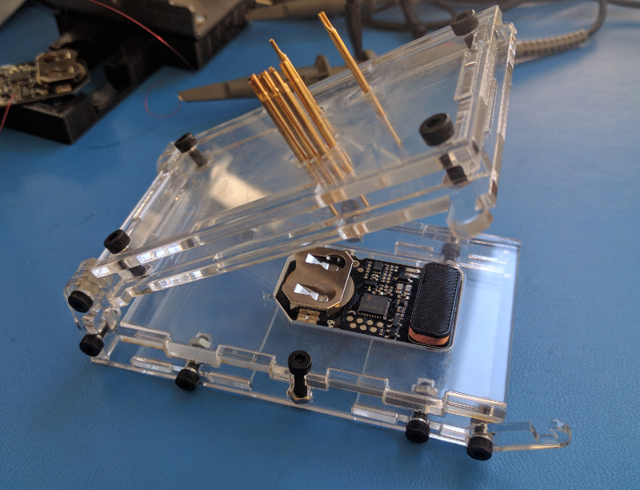
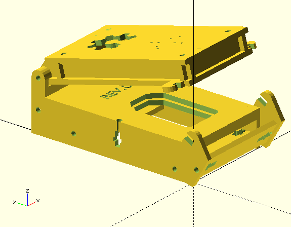

# OpenFixture - Modern PCB Test Fixture Generator


**Automated laser-cuttable PCB test fixture generation for KiCAD 8.0 and 9.0+**

OpenFixture is a comprehensive PCB test fixture generator that integrates directly with KiCAD to automatically create laser-cuttable fixtures for your boards. Fully modernized with KiCAD 9.0+ API compatibility, Python 3 support, and enhanced error handling.

---

## 🚀 Key Features

- ✅ **Full KiCAD 9.0+ Compatibility** - Tested and working with KiCAD 9.0 API
- ✅ **Backward Compatible with KiCAD 8.0** - Automatic API version detection
- ✅ **Python 3 Modern Codebase** - Type hints, modern syntax, PEP 8 compliant
- ✅ **TOML Configuration** - Project-specific configuration files
- ✅ **Enhanced Plugin UI** - Multi-tab dialog with material presets
- ✅ **Comprehensive Error Handling** - Detailed logging and user-friendly error dialogs
- ✅ **Automatic OpenSCAD Integration** - Seamless 3D model and DXF generation
- ✅ **Modular Architecture** - Clean, maintainable, well-documented code

---

## 📦 Quick Start

### Installation

#### Option 1: KiCAD Plugin Manager (Recommended)

1. Open KiCAD PCB Editor
2. Go to: `Tools → Plugin and Content Manager`
3. Search for: **OpenFixture**
4. Click: `Install`
5. Restart KiCAD
6. Access: `Tools → External Plugins → OpenFixture Generator`

#### Option 2: Build and Install from Source

```bash
# 1. Clone or download this repository
git clone https://github.com/RolandWa/openfixture.git
cd openfixture

# 2. Install Python dependencies (optional, for TOML support)
pip install tomli  # Only needed for Python < 3.11

# 3. Build and deploy the plugin
python build.py --deploy

# The plugin will be automatically installed to your KiCAD plugins directory
# Restart KiCAD to load the plugin

# Alternative deployment methods:
python build.py              # Build package + ZIP for distribution
python build.py --zip        # Create ZIP only (for Plugin Manager)
python build.py --clean      # Clean build artifacts
```

**Manual Installation Paths**:
- Windows: `%APPDATA%\kicad\9.0\3rdparty\plugins\`
- Linux: `~/.local/share/kicad/9.0/3rdparty/plugins/`
- macOS: `~/Documents/KiCAD/9.0/3rdparty/plugins/`

#### Option 3: Development Sync Script

**Fast sync for testing code changes**:
```powershell
# First, set up your personal configuration (one-time):
cp sync_to_kicad_config.ps1.template sync_to_kicad_config.ps1
# Edit sync_to_kicad_config.ps1 with your KiCAD plugins path

# Deploy to KiCAD (auto-clears Python cache):
.\sync_to_kicad.ps1  # Windows PowerShell

# Restart KiCAD to load changes
```

**Benefits**: Fastest way to test code changes - copies directly from `src/` to KiCAD, automatically clears Python cache to force reload.

### 🔒 Security Note

Personal configuration files (like `sync_to_kicad_config.ps1`) are excluded from version control to protect your privacy. Always use the `.template` files as a starting point and never commit files containing personal paths. See [SECURITY.md](SECURITY.md) for details.

### Basic Usage

**Command Line**:
```bash
python src/openfixture_support/GenFixture.py \
    --board your_board.kicad_pcb \
    --mat_th 3.0 \
    --out fixture-output
```

**With Configuration File**:
```bash
# 1. Create fixture_config.toml in your project directory
# 2. Run with config:
python src/openfixture_support/GenFixture.py \
    --board your_board.kicad_pcb \
    --config fixture_config.toml \
    --out fixture-output
```

**KiCAD Plugin**:
```
1. Open your PCB in KiCAD PCB Editor
2. Tools → External Plugins → OpenFixture Generator
3. Configure parameters in dialog
4. Click "Generate Fixture"
5. Output directory opens automatically
```

---

## � Project Structure

OpenFixture uses a modern Python src-layout for clean separation between source code and build artifacts:

```
openfixture/
├── src/                              # Source code directory
│   ├── __init__.py                   # Plugin registration entry point
│   ├── openfixture.py                # KiCAD ActionPlugin (wxPython UI)
│   └── openfixture_support/          # Core package
│       ├── __init__.py
│       ├── GenFixture.py             # Main processing engine
│       ├── openfixture.scad          # OpenSCAD fixture generator
│       └── fixture_config.toml       # Configuration template
├── build.py                          # KiCAD plugin build system
├── setup.py                          # Python package installation
├── pyproject.toml                    # Modern Python packaging config
└── .github/
    └── copilot-instructions.md       # Development guidelines
```

**Build Output**:
```
build/
└── com_github_RolandWa_openfixture/  # Plugin package for KiCAD
    ├── __init__.py
    ├── openfixture.py
    ├── OpenFixture.png               # Plugin icon
    ├── plugin.json                   # KiCAD plugin descriptor
    ├── metadata.json                 # KiCAD PCM metadata
    ├── openfixture_support/
    └── README.md
```

**Benefits of src-layout**:
- Prevents accidental imports from development directory
- Clear separation between source and built artifacts
- Standard Python packaging structure
- Consistent with modern Python projects

---

## �📋 Requirements

### Software
- **KiCAD** 8.0 or 9.0+
- **Python** 3.8 or later
- **OpenSCAD** 2015.03 or later
- **Laser cutter** or laser cutting service

### Python Packages
- `pcbnew` (included with KiCAD)
- `tomli` (optional, for Python < 3.11)

### Hardware
- M3 screws (14-20mm length)
- M3 hex nuts
- M3 washers (optional)
- **Pogo pins and receptacles** - See **[POGO_PINS.md](POGO_PINS.md)** for complete specifications
- Laser-cut material (acrylic or plywood, 2-5mm thick)

---

## 🔌 Pogo Pin (Test Probe) Hardware

**Spring-loaded test probes** (pogo pins) are the critical contact elements that make electrical connection to your PCB test points. OpenFixture supports standard pogo pin series from multiple manufacturers.

### Quick Selection

| Use Case | Recommended | Cost | Cycle Life |
|----------|-------------|------|------------|
| **Prototypes & Low Volume** | P75-E2 (24mm crown tip) | $0.30/point | 10k-50k cycles |
| **Production & High Volume** | Fixtest 100 series | $3.50/point | 100k+ cycles |

### Pogo Pin Series

**[P75 Series](https://www.digole.com/index.php?categoryID=115)** (Budget-Friendly)
- Price: $0.16-$0.22 per pin + ~$0.10 receptacle
- Length options: 16.5-33.3mm (7 models: A2, B1, D2, D3, E2, F1, G2)
- Cycle life: 10,000-50,000 cycles
- Best for: Prototypes, low-volume testing, hobbyist projects

**[Fixtest Series 100](https://www.tme.eu/pl/details/s100.00-l/igly-testowe/fixtest/s-100-00-l/)** (Professional Grade)
- Price: ~$3.50 per test point (receptacle + probe)
- Length: 29.6mm (S 100.00-L receptacle)
- Cycle life: 100,000+ cycles
- Best for: Production testing, automated equipment, high-volume

### Configuration

Set in `fixture_config.toml`:
```toml
[hardware]
pogo_uncompressed_length_mm = 24.0  # For P75-E2 (recommended)
# pogo_uncompressed_length_mm = 16.5  # For P75-A2/B1
# pogo_uncompressed_length_mm = 29.6  # For Fixtest 100
```

### 📘 Complete Guide

**See [POGO_PINS.md](POGO_PINS.md) for comprehensive documentation:**
- Detailed specifications for all models
- Tip style selection guide (sharp, round, flat, crown)
- Installation and assembly instructions
- Maintenance and replacement schedules
- Cost analysis and ROI calculations
- Supplier information and alternatives
- Troubleshooting and FAQs

### Test Point Extraction

OpenFixture automatically identifies test points on your PCB using intelligent pad detection. The software scans your KiCAD PCB file and selects pads based on specific criteria designed for reliable electrical testing.

#### How Test Points Are Selected

The test point selection algorithm evaluates each pad on the PCB using the following criteria (in order of precedence):

**1. Force Layer (Highest Priority)**
- Any pad on the **force layer** (default: `Eco2.User`) is **always included** as a test point
- This overrides all other rules
- Use this to manually designate specific pads as test points
- Example: Draw on Eco2.User layer in KiCAD to force-include a pad

**2. Ignore Layer**
- Any pad on the **ignore layer** (default: `Eco1.User`) is **always excluded**
- Use this to explicitly prevent specific pads from becoming test points
- Example: Draw on Eco1.User layer to exclude a dense BGA area

**3. Solder Paste Mask Check**
- Pads with **solder paste mask** are excluded (they're designed for reflow soldering, not testing)
- Only pads with **exposed copper** (no paste mask) are considered
- Standard test points typically have paste mask removed in KiCAD footprint

**4. Pad Type Filtering**
- **SMD Pads** (`PAD_ATTRIB_SMD`):
  - Surface mount pads (designed test points, IC pins, etc.)
  - Included if `include_smd_pads = true` in config
  - Same-side testing: Pogo pins contact pad directly from the test side
  
- **PTH Pads** (`PAD_ATTRIB_PTH`) - **Opposite Side Rule**:
  - Through-hole pads (connectors, component leads, vias)
  - Included if `include_pth_pads = true` in config
  - **Critical**: Only PTH pads from components on the **opposite side** are used
  - **Rationale**: Component body blocks access from the same side
  - **Example**: 
    - Testing from **bottom** (B.Cu) → Uses PTH pads from **top-side** components (F.Cu)
    - Testing from **top** (F.Cu) → Uses PTH pads from **bottom-side** components (B.Cu)
  - This allows testing through-hole connector pins from the back of the board

**5. Layer Selection**
- Only pads on the **selected layer** are included (F.Cu for top, B.Cu for bottom)
- Single-sided testing: Choose either top OR bottom
- Each test point must be on the active test layer

#### Test Point Selection Matrix

| Condition | SMD Pads | PTH Pads (Same Side*) | PTH Pads (Opposite Side*) |
|-----------|----------|---------------------|------------------------|
| **On Force Layer (Eco2.User)** | ✅ Always | ✅ Always | ✅ Always |
| **On Ignore Layer (Eco1.User)** | ❌ Never | ❌ Never | ❌ Never |
| **Has Paste Mask** | ❌ Excluded | ❌ Excluded | ❌ Excluded |
| **No Paste Mask + include_smd=true** | ✅ Included | N/A | N/A |
| **No Paste Mask + include_pth=true** | N/A | ❌ Excluded | ✅ Included |
| **include_smd=false or include_pth=false** | ❌ Excluded | ❌ Excluded | ❌ Excluded |

\* *Same Side* = Component on same layer as test points (e.g., test F.Cu, component on F.Cu)  
\* *Opposite Side* = Component on opposite layer from test points (e.g., test B.Cu, component on F.Cu)

#### Configuration Control

Control test point selection in `fixture_config.toml`:

```toml
[board]
test_layer = "F.Cu"  # "F.Cu" (top) or "B.Cu" (bottom)

[test_points]
include_smd_pads = true  # Include surface mount pads
include_pth_pads = true  # Include through-hole pads (opposite side only)

[layers]
force_layer = "Eco2.User"   # Force include pads marked with this layer
ignore_layer = "Eco1.User"  # Exclude pads marked with this layer
```

#### Practical Examples

**Example 1: USB Connector Testing**
- USB connector mounted on **top side** (F.Cu)
- Component body on top prevents direct access to pins from top
- Solution: Test from **bottom side** (B.Cu) using PTH pads
- Through-hole pins are accessible from bottom while connector sits on top

**Example 2: Test Points Only**
- SMD test points added to **top side** (F.Cu)
- No paste mask on test points
- Solution: Test from **top side** (F.Cu) with include_smd=true
- Pogo pins contact test pads directly

**Example 3: Mixed Testing**
- Test points on **top side** (F.Cu) - use SMD pads
- Connector pins from top components - use PTH pads from **bottom side** (B.Cu)
- Configure: `test_layer = "B.Cu"`, `include_smd_pads = true`, `include_pth_pads = true`

#### Verification

OpenFixture generates `track.dxf` overlay showing detected test points. Import this into KiCAD to verify:
1. All required test points are detected
2. No unwanted pads are included
3. Alignment is correct
4. Use force/ignore layers to adjust as needed

### Parametric Generation
- OpenSCAD-based 3D model
- Adjustable material thickness
- Custom hardware dimensions
- Configurable pogo pin placement

### Output Files
- **fixture.dxf** - Laser-cuttable parts layout
- **fixture.png** - 3D preview rendering
- **test.dxf** - Material fit test piece
- **outline.dxf** - Board outline reference
- **track.dxf** - Test point verification overlay for selected test layer

---

## 🔧 Fixture Assembly Structure

OpenFixture generates a **four-layer clamshell fixture** designed for single-sided testing (either top OR bottom layer test points, not both simultaneously).

### Layer Structure

The assembled fixture consists of four laser-cut plates:

**Top Layers (2 plates with pogo pin holes):**
1. **head_base** - Lower guide plate with pogo pin holes, lock tabs, and hex nut mounting points
2. **head_top** - Upper alignment plate with pogo pin holes and cable relief features

Both top plates share identical pogo pin hole patterns (generated by `head_base_common()` module) to keep pins perfectly aligned and straight during PCB contact.

**Bottom Layers (2 PCB carrier plates):**
1. **Top carrier** - Has precise PCB outline cutout (border = `pcb_support_border`, default 1mm) to securely hold the board
2. **Bottom carrier** - Has smaller PCB outline cutout (border = -0.05mm) to provide clearance for components without interference

### Technical Implementation

The fixture design is parametrically generated in OpenSCAD:

**Pogo Pin Hole Generation:**
```scad
// Both head_base and head_top call head_base_common()
// which generates holes for all test points
module head_base_common () {
    // Top side test points
    for ( i = [0 : len (test_points_top) - 1] ) {
        translate ([origin_x + test_points_top[i][0], origin_y - test_points_top[i][1]])
        circle (r = pogo_r);  // Pogo pin radius (0.75mm default)
    }
    // Bottom side test points
    for ( i = [0 : len (test_points_bottom) - 1] ) {
        translate ([origin_x + test_points_bottom[i][0], origin_y - test_points_bottom[i][1]])
        circle (r = pogo_r);
    }
}
```

**PCB Carrier Generation:**
```scad
// First carrier: precise PCB holder
carrier (pcb_outline, pcb_x, pcb_y, pcb_support_border);  // border = 1mm (default)

// Second carrier: component clearance
carrier (pcb_outline, pcb_x, pcb_y, -0.05);  // border = -0.05mm (smaller cutout)
```

The `carrier()` module scales the PCB outline based on the border parameter:
- **Positive border** (e.g., 1mm): Creates cutout larger than PCB for secure fit
- **Negative border** (e.g., -0.05mm): Creates cutout smaller than PCB for component clearance

### Assembly Example



*Example of assembled fixture showing the four-layer construction with pogo pins installed in the top layers and PCB positioned in the bottom carrier plate.*



*3D rendering showing the clamshell design opened to reveal the four-layer structure and PCB placement.*

### Key Design Features

- **Dual pogo pin plates** - Both top plates have identical hole patterns for perfect pin alignment
- **PCB retention** - Top carrier has precise cutout (configurable via `--border` parameter)
- **Component clearance** - Bottom carrier has smaller cutout to avoid interference with PCB components
- **Clamshell design** - Hinged assembly allows easy board insertion and removal
- **Single-sided testing** - Fixture is configured for either top (F.Cu) or bottom (B.Cu) test points
- **Hardware mounting** - M3 screws and hex nuts secure the assembly at corners with lock tabs

### Code Verification

✅ **head_base** module calls `head_base_common()` - generates pogo pin holes ([openfixture.scad:350-390](openfixture.scad))  
✅ **head_top** module calls `head_base_common()` - identical hole pattern ([openfixture.scad:403-432](openfixture.scad))  
✅ **carrier** module with `pcb_support_border` parameter ([openfixture.scad:686-724](openfixture.scad))  
✅ **lasercut** module generates two carriers with different borders ([openfixture.scad:867-871](openfixture.scad))  
✅ **--border** command-line parameter controls `pcb_support_border` value ([GenFixture.py:789-790](GenFixture.py))

---

## ⚙️ Configuration

### TOML Configuration File

Create `fixture_config.toml` in your project directory:

```toml
[board]
thickness_mm = 1.6
test_layer = "F.Cu"  # Options: "F.Cu" (top), "B.Cu" (bottom) - select which side to test

[material]
thickness_mm = 3.0

[hardware]
screw_diameter_mm = 3.0
screw_length_mm = 16.0
nut_thickness_mm = 2.4
nut_flat_to_flat_mm = 5.45
nut_corner_to_corner_mm = 6.10
washer_thickness_mm = 1.0
border_mm = 1.0  # PCB carrier cutout border (default: 1.0mm)
                 # Larger values = looser PCB fit, smaller = tighter fit
pogo_uncompressed_length_mm = 16.0

[layers]
force_layer = "Eco2.User"  # Force include pads on this layer as test points
ignore_layer = "Eco1.User" # Exclude pads on this layer from test points
```

### Command-Line Arguments

```bash
python src/openfixture_support/GenFixture.py \
    --board <file.kicad_pcb>        # Required: PCB file path
    --mat_th <mm>                   # Required: Material thickness
    --out <directory>               # Required: Output directory
    --config <file.toml>            # Optional: Config file
    --pcb_th <mm>                   # Optional: PCB thickness (default: 1.6)
    --layer <F.Cu|B.Cu>             # Optional: Test point layer (top or bottom)
    --rev <string>                  # Optional: Revision string
    --screw_len <mm>                # Optional: Screw length (default: 16.0)
    --screw_d <mm>                  # Optional: Screw diameter (default: 3.0)
    --nut_th <mm>                   # Optional: Nut thickness
    --nut_f2f <mm>                  # Optional: Nut flat-to-flat
    --nut_c2c <mm>                  # Optional: Nut corner-to-corner
    --washer_th <mm>                # Optional: Washer thickness
    --border <mm>                   # Optional: PCB carrier cutout border (default: 1.0)
    --pogo-uncompressed-length <mm> # Optional: Pogo pin length
    --verbose                       # Optional: Enable verbose logging
```

---

## 📖 Documentation

- **[POGO_PINS.md](POGO_PINS.md)** - Comprehensive pogo pin selection and specification guide
- **[.github/copilot-instructions.md](.github/copilot-instructions.md)** - Project structure and development guidelines
- **[MIGRATION_GUIDE.md](MIGRATION_GUIDE.md)** - Upgrade guide from legacy versions
- **[src/openfixture_support/fixture_config.toml](src/openfixture_support/fixture_config.toml)** - Configuration file template
- **[README.md](README.md)** - This file (comprehensive user guide)

### Original Project Documentation
- **Main Site**: http://tinylabs.io/openfixture
- **BOM**: http://tinylabs.io/openfixture-bom
- **Assembly**: http://tinylabs.io/openfixture-assembly
- **KiCAD Export**: http://tinylabs.io/openfixture-kicad-export

---

## 🔄 Migration from v1

If you're upgrading from a legacy version, see **[MIGRATION_GUIDE.md](MIGRATION_GUIDE.md)** for detailed upgrade instructions.

**Quick comparison**:

| Feature | Legacy (Original) | Current (KiCAD 9+) |
|---------|---------------|-------------|
| KiCAD 6.0/7.0 | ✅ Full | ⚠️ Limited |
| KiCAD 8.0/9.0 | ❌ No | ✅ Full |
| Python 2 | ✅ Yes | ❌ No |
| Python 3 | ⚠️ Partial | ✅ Full |
| TOML Config | ❌ No | ✅ Yes |
| Type Hints | ❌ No | ✅ Yes |
| Modern UI | ❌ No | ✅ Yes |
| Error Handling | ⚠️ Basic | ✅ Complete |

---

## 🛠️ Development

### File Structure

```
openfixture/
├── GenFixture.py              # Main generator
├── openfixture.py             # KiCAD plugin
├── fixture_config.toml        # Configuration template
├── genfixture.bat             # Windows wrapper
├── genfixture.sh              # Linux/Mac wrapper
├── openfixture.scad           # OpenSCAD model
│
├── GenFixture.py              # Original generator (v1, legacy)
├── openfixture.py             # Original plugin (v1, legacy)
├── genfixture.bat             # Original wrapper (v1, legacy)
├── genfixture.sh              # Original wrapper (v1, legacy)
│
├── copilot-instructions_openfixture.md  # Complete documentation
├── MIGRATION_GUIDE.md                   # Legacy upgrade guide
├── README_v2.md                         # This file
└── README.md                            # Original README
```

### Key Classes

**GenFixture.py**:
```python
class FixtureConfig:
    """Configuration container with TOML support"""

class GenFixture:
    """Main fixture generator with modern KiCAD API"""
    
    def get_test_points(self) -> None
    def get_origin_dimensions(self) -> None
    def plot_dxf(self, path: str, layer: str) -> None
    def generate(self, path: str) -> bool
```

**openfixture.py**:
```python
class OpenFixtureDialog(wx.Dialog):
    """Modern multi-tab parameter dialog"""
    
    def _create_board_panel(self, parent) -> wx.Panel
    def _create_material_panel(self, parent) -> wx.Panel
    def _create_hardware_panel(self, parent) -> wx.Panel
    def get_parameters(self) -> dict

class OpenFixturePlugin(pcbnew.ActionPlugin):
    """KiCAD action plugin entry point"""
    
    def Run(self) -> None
```

---

## 🐛 Troubleshooting

### Common Issues

**"No module named 'tomllib'"**
```bash
# Install tomli for Python < 3.11
pip install tomli

# Or run without config file
python src/openfixture_support/GenFixture.py --board test.kicad_pcb --mat_th 3.0 --out fixture
```

**"No test points found"**
- Ensure SMD pads have **no paste mask** in KiCAD
- Or use Eco2.User layer to force include specific pads
- Check that correct layer (F.Cu/B.Cu) is selected

**"Could not find GenFixture.py" (plugin error)**
```
# Ensure both files are in plugins directory:
plugins/
├── openfixture.py
└── GenFixture.py
```

**Plugin not appearing in KiCAD**
1. Check file permissions (must be readable)
2. Verify correct plugins directory for your KiCAD version
3. Restart KiCAD completely
4. Check: Tools → Plugin and Content Manager

### Verbose Logging

Enable detailed logging for troubleshooting:
```bash
python src/openfixture_support/GenFixture.py --board test.kicad_pcb --mat_th 3.0 --out fixture --verbose
```

---

## 📝 Examples

### Standard 1.6mm PCB, 3mm Acrylic

```bash
python src/openfixture_support/GenFixture.py \
    --board my_board.kicad_pcb \
    --mat_th 3.0 \
    --pcb_th 1.6 \
    --out fixture-rev01 \
    --rev "rev_01"
```

### Thin PCB, 2.5mm Acrylic

```bash
python src/openfixture_support/GenFixture.py \
    --board thin_board.kicad_pcb \
    --mat_th 2.45 \
    --pcb_th 0.8 \
    --screw_len 14.0 \
    --out fixture-thin
```

### Bottom Side Testing

```bash
python src/openfixture_support/GenFixture.py \
    --board my_board.kicad_pcb \
    --mat_th 3.0 \
    --layer B.Cu \
    --out fixture-bottom
```

### Using Configuration File

```bash
# Create fixture_config.toml with your parameters
# Then simply run:
python src/openfixture_support/GenFixture.py \
    --board my_board.kicad_pcb \
    --config fixture_config.toml \
    --out fixture
```

---

## 📜 License

**Creative Commons CC BY-SA 4.0**

You are free to:
- **Share** - Copy and redistribute the material
- **Adapt** - Remix, transform, and build upon the material

Under the following terms:
- **Attribution** - Give appropriate credit
- **ShareAlike** - Distribute under the same license

See: https://creativecommons.org/licenses/by-sa/4.0/

---

## 👤 Contributors

**Original Author**:
- Elliot Buller - Tiny Labs Inc (elliot@tinylabs.io)
- Original Project Website: http://tinylabs.io/openfixture

**Current Maintainer**:
- Roland Wa (gitrepository Team)
- Repository: https://github.com/RolandWa/openfixture

**Modernization & KiCAD 9+ Compatibility** (2024-2026):
- For contributions, please use GitHub pull requests at https://github.com/RolandWa/openfixture

**Key Updates**:
- ✅ **Modern Python src-layout** - Clean separation with build system (build.py)
- ✅ **KiCAD 9.0+ Full Compatibility** - All breaking API changes fixed with backward compatibility for KiCAD 8.0
- ✅ **Enhanced OpenSCAD Integration** - Robust subprocess execution with proper error handling, timeouts, and path resolution
- ✅ **Python 3.11+ Modernization** - Type hints, pathlib, dataclasses, comprehensive logging
- ✅ **TOML Configuration System** - Project-specific fixture parameters in `fixture_config.toml`
- ✅ **Enhanced Plugin UI** - Scrollable error dialogs with copy-to-clipboard, output file verification
- ✅ **Security Improvements** - Configuration template system, no hardcoded paths, comprehensive .gitignore
- ✅ **Comprehensive Documentation** - Updated README, migration guide, security documentation, AI assistant instructions

---

## 🔗 Links

- **GitHub Repository**: https://github.com/RolandWa/openfixture
- **Original Project**: http://tinylabs.io/openfixture
- **OpenSCAD**: https://openscad.org/
- **KiCAD**: https://www.kicad.org/
- **KiCAD Python API**: https://docs.kicad.org/doxygen/

---

## 💡 Tips & Best Practices

### PCB Design
- Place test pads in accessible locations (not under components)
- Use consistent pad size (≥0.5mm diameter)
- Remove **both** solder mask and paste mask from test pads
- Use clear net naming for troubleshooting

### Material Selection
- **Acrylic**: Best precision (±0.05mm), transparent, but can crack
- **Plywood**: Budget-friendly, strong, but lower precision (±0.2mm)
- **Measure actual thickness** with calipers before cutting
- Use **test cut piece** to verify fit before full fixture

### Hardware
- **M3 hardware** is the standard (readily available worldwide)
- Measure nut dimensions with calipers (varies by manufacturer: 5.4-5.5mm typical)
- Use **nylon-insert lock nuts** for fixtures that will be opened/closed frequently
- Washer selection: Stainless steel washers provide smooth hinge operation

### Pogo Pins
- **See [POGO_PINS.md](POGO_PINS.md) for complete specifications and selection guide**
- **Budget builds**: P75 series ($0.30/point) - 10k-50k cycles, ideal for prototypes
- **Production builds**: Fixtest 100 (~$3.50/point) - 100k+ cycles, for high-volume testing
- **Compression**: Target 1.0-1.5mm (configured automatically by OpenFixture)
- **Tip selection**: Crown (general), Sharp (fine pitch), Flat (high current), Rounded (PTH)
- Use **two-part system** (receptacle + replaceable probe) for easy maintenance
- Keep spare probes on hand - replace before reaching 75% of cycle life

### Workflow
1. Design PCB in KiCAD with test pads
2. Create `fixture_config.toml` for project
3. Generate fixture with v2
4. Review 3D preview PNG
5. Cut test piece first (verify fit)
6. Cut full fixture
7. Assemble and test

---

## 🆘 Getting Help

1. Check **[POGO_PINS.md](POGO_PINS.md)** for pogo pin selection, installation, and troubleshooting
2. Check **[.github/copilot-instructions.md](.github/copilot-instructions.md)** for project structure and development guidelines
3. Review **[MIGRATION_GUIDE.md](MIGRATION_GUIDE.md)** if upgrading from v1
4. Enable `--verbose` logging to diagnose issues
5. Check GitHub Issues: https://github.com/RolandWa/openfixture/issues
6. Review documentation: https://github.com/RolandWa/openfixture/tree/main/README.md
7. Original project documentation: http://tinylabs.io/openfixture

---

**Version**: 1.0.0  
**Last Updated**: January 2025  
**Compatibility**: KiCAD 8.0+, Python 3.8+, OpenSCAD 2015.03+
